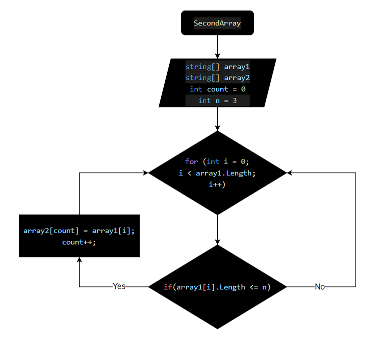

# Блок - Выбор специализации
### Итоговая проверочная работа
***
## Задача
Написать программу, которая из имеющегося массива строк формирует массив из строк, длинна которых меньше либо равнв 3 символа. Первоначальный массив можно ввести с клавиатуры, либо задать на старте выполнения алгоритма.

*При решении не рекомендуется пользоваться коллекциями, лучше обойтись исключительно массивами.*

## Описание алгоритма решения:

* обьявляем переменную и присваиваем значение *_3_* *_(int = 3)_*
* объявляем два массива: изначальный и вторый такой же длины
* метод, в котором цикл соразмерный длине массива
* внутри цикла проверка условия *_(<=n)_*
* если да элемент первого массива заносится в *_count_* элемента второго массива.
* переменная *_count_* поочередно закидывает из первого массива во второй.
* после присвоения увеличивается переменная *_count_* на *_1_* и возвращается к циклу *_for*_ в котором *_i_* увеличивается на *_1_*.

***
#### Блок схема
